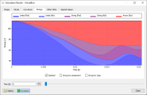

# Bow Simulator
<h3>Bow and arrow physics simulation for Windows and Linux</h3>

---

Bow Simulator is a free, open-source software tool for simulating the physics of bow and arrow.
It allows users to design virtual bows and calculate static and dynamic characteristics such as deformation, draw curve, material stresses, arrow velocity, degree of efficiency and more.
This way bow designs can be evaluated and optimized before actually building them.

However, please note that this software is still somewhat immature, so don't trust the results too much yet and report any bugs that you find.

For more information see the feature list below or have a look at the [user manual](resources.md).
Visit the [download section](download.md) to get the latest version and subscribe to the [mailing lists](mailing-lists.md) if you want to keep up with the project.

## Screenshots

---

## Features

---

**Graphical Bow Editor**

* Create, load and save bow models
* Edit profile, layers, material properties and other parameters

**Performance Simulation**

* Simulate the statics and dynamics of the bow
* Uses a finite element method internally
* Static results:
    - Limb shapes
    - Draw curve
    - Stored energy
    - Stress distribution
    - ...
* Dynamic results:
    - Position, velocity and acceleration of string and arrow
    - Kinetic and potential energy
    - Degree of efficiency
    - ...

**Command Line Interface**

* Run simulations in batch mode
* Call Bow Simulator from other programs. The [user manual](resources.md#User Manual) contains an example for Python.
* Perform parameter studies and design optimizations

<!--
**Fully Documented**

* [User Manual](resources.md#User Manual): Helps you getting started with the program.
* [Technical Documentation](resources.md#Technical Documentation): Detailed documentation of the internal simulation methods.
  
-->

**Free and Open-Source**

* Released under the [GNU General Public License v3.0](https://www.gnu.org/licenses/gpl.html)
* Free to use, modify and redistribute
* Anyone can [get involved](contributing.md) in the development

**Cross-Platform**

* [Downloads](download.md) are available for Windows and Linux
