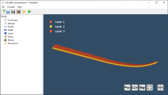
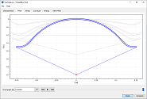
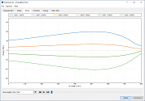
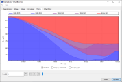

disable_toc: true

    

    <h1><b>VirtualBow</b></h1>
    <h4>Software for designing and simulating bows</h4>

---

Create bow models by specifying design parameters such as limb geometry, layers and material properties.
Simulate them to reveal how a design performs and where it might fail:
What do the bending shapes of the limbs look like? How are stresses and strains distributed?
What arrow velocity and degree of efficiency can be expected?
The results let you explore these and many other questions.

VirtualBow can be used to refine bow designs before actually building them, to reverse-engineer existing bows and understand what makes them work, or simply as a playground for learning and experimenting.

For more details see the screenshots and feature list below or have a look at the [user manual](files/user-manual/index.html).

---

---

## Features

---

**Model Editor**

- Create, load and save bow models
- Edit the limb geometry, layers, materials and other properties of your bow

**Solver & Result Viewer**

- Simulate the statics and dynamics of a bow with the [finite element method (FEM)](https://en.wikipedia.org/wiki/Finite_element_method)
- Static results: How the bow behaves as it is drawn from brace height to full draw
    - Limb shapes
    - Force/draw curve
    - Stored energy
    - Stress distribution
    - ...
- Dynamic results: How bow and arrow behave after the string is released
    - Position, velocity and acceleration of string and arrow
    - Kinetic and potential energy
    - Degree of efficiency
    - ...

**Command Line Interface**

- Run simulations from the command line, without opening the user interface
- Call VirtualBow from external programs and scripts for parameter studies and design optimizations

**Fully Documented**

- [User Manual](files/user-manual/index.html): Explains all features of the program and helps you get started
- [Theory Manual](files/theory-manual.pdf): Detailed documentation of the internal simulation methods

**Free for Noncommercial Use**

- Released under the [PolyForm Noncommercial License 1.0.0](https://polyformproject.org/licenses/noncommercial/1.0.0/)
- Free to use, modify and redistribute for noncommercial purposes
- The full source code is available, and anyone can [get involved](contributing.md) in development

**Cross-Platform**

- [Downloads](download.md) for Windows, macOS and Linux

 