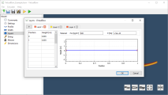
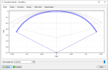

# Bow Simulator
<h3>Bow and arrow physics simulation for Windows and Linux</h3>

---

<meta property="og:image" content="../images/screenshot_01_thumb.png" />

---

## Overview

---

Bow Simulator is a bow and arrow design tool that allows you to create virtual bow models and simulate their performance.
The results include many static and dynamic characteristics of the bow such as deformation, draw curve, material stresses, arrow velocity, degree of efficiency and more.
It can be used for evaluating and optimising bow designs before actually building them. Please note though that this software is still somewhat immature, so don't trust the results too much yet.

Bow Simulator is free open-source software released under the [GNU General Public License v3.0](https://www.gnu.org/licenses/gpl.html).

For more detailed information see the feature list below or have a look at the [user manual](resources.md). Visit the [download section](download.md) to get the latest version. If you want to keep up with this project, subscribe to the new [mailing lists](mailing-lists.md).

## Features

---

**Graphical Bow Editor**

* Create, load and save bow models
* Specify limb profile, cross sections and many other parameters
* Limitations for now:
    * Only rectangular, uniform cross sections
    * No string-to-limb contact (needed for recurve bows)

**Static and Dynamic Analysis**

* Simulate the statics and dynamics of the bow
* Uses a finite element method internally
* Some static results:
    - Limb shapes
    - Draw curve
    - Stored energy
    - Stress distribution
    - ...
* Some dynamic results:
    - Position, velocity and acceleration of string and arrow
    - Kinetic and potential energy
    - Degree of efficiency
    - ...

<!--
#### Command-line Interface

* Invoke Bow Simulator from the command line
* Use a scripting language of your choice to automate simulations
* [Commented examples for parameter studies and optimisations using Python and SciPy]()
-->

<!--
**Fully Documented**

* [User Manual](resources.md#User Manual): Helps you getting started with the program.
* [Technical Documentation](resources.md#Technical Documentation): Detailed documentation of the internal simulation methods.
  
-->

**Free and Open-Source**

* Released under the [GNU General Public License v3.0](https://www.gnu.org/licenses/gpl.html).
* Free to use, modify and redistribute
* Anyone can [get involved](contributing.md) in the development

**Cross-Platform**

* [Downloads](download.md) are available for Windows and Linux
