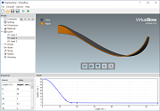

    

    <h1>VirtualBow</h1>
    <h4>Bow & Arrow Physics Simulation</h4>

---

VirtualBow is a free, open-source software tool for designing and simulating bows.
It gives users an easy way to test and optimize their designs before actually building them.
The simulation results include a variety of static and dynamic characteristics of the bow such as the draw curve, limb deformation, material stress, arrow velocity and degree of efficiency.

However, please note that this software is still somewhat immature, so don't trust the results too much and report any bugs that you find.

For more details see the screenshots and feature list below or have a look at the [user manual](resources.md).
Visit our subreddit [r/VirtualBow](https://www.reddit.com/r/VirtualBow) for news, support and general discussion.

## Screenshots

---

## Features

---

**Graphical Bow Editor**

* Create, load and save bow models
* Edit layers, profile, material properties and other parameters

**Static and Dynamic Simulation**

* Simulate the statics and dynamics of the bow
* Uses a finite element method internally
* Static results:
    - Limb shapes
    - Draw curve
    - Stored energy
    - Stress distribution
    - ...
* Dynamic results:
    - Position, velocity and acceleration of string and arrow
    - Kinetic and potential energy
    - Degree of efficiency
    - ...

**Command Line Interface**

* Run simulations in batch mode
* Call VirtualBow from other programs/scripts. The [user manual](resources.md#User Manual) shows an example for Python.
* Perform complex custom computations, like parameter studies and design optimizations

**Fully Documented**

* [User Manual](resources.md#User Manual): Documents all features of the program and helps you getting started.
* [Theory Manual](resources.md#Theory Manual): Detailed documentation of the internal simulation methods.

**Free and Open-Source**

* Released under the [GNU General Public License v3.0](https://www.gnu.org/licenses/gpl.html)
* Free to use, modify and redistribute
* Anyone can [get involved](about.md) in the development

**Cross-Platform**

* [Downloads](download.md) are available for Windows, Linux and MacOS
