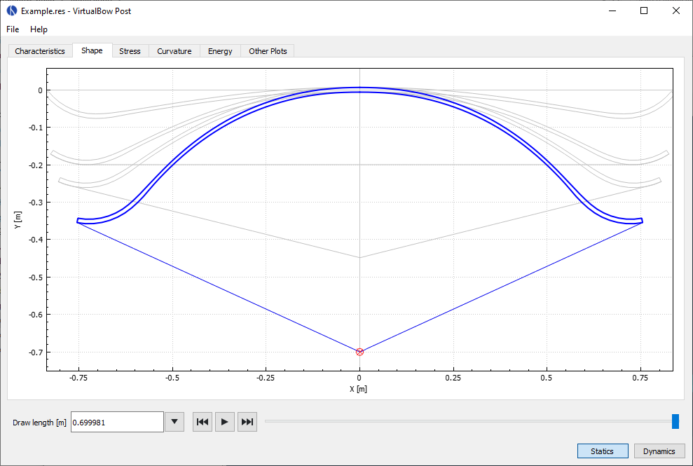

# Bow Simulator
<h3>Bow and arrow physics simulation for Windows, Linux and Mac OS X</h3>

---

Bow Simulator is a bow and arrow design tool that allows you to create virtual bows and simulate their performance.
It can calculate a wide range of static and dynamic characteristics such as the draw curve, material stresses, arrow velocity and degree of efficiency.
It can be used for evaluating and optimising bow designs before actually building them.

Bow Simulator is free open-source software released under the [GNU General Public License v3.0](https://www.gnu.org/licenses/gpl.html).

Have a look at the screenshots and feature list below, read the [user manual](resources.md) or visit the [download section](download.md) to get the latest version. If you're interested in news and discussion about this project, subscribe to the new [mailing lists](mailing-lists.md).

## Screenshots

---

## Features

---

**Graphical Bow Editor**

* Load and save your designs
* Specify limb profile, cross sections and other parameters
* Limitations for now:
    * Only rectangular, uniform cross sections
    * No string-to-limb contact
      

**Static and Dynamic Analysis**

* Simulate the statics and dynamics of the bow (Uses a finite element method internally)
* Static results: Deformed limb shapes, draw curve, stored energy, stress distribution, ...
* Dynamic results: Position, velocity and acceleration of string and arrow, kinetic and potential energy, degree of efficiency, ...
  

<!--
#### Command-line Interface

* Invoke Bow Simulator from the command line
* Use a scripting language of your choice to automate simulations
* [Commented examples for parameter studies and optimisations using Python and SciPy]()
-->

<!--
**Fully Documented**

* [User Manual](resources.md#User Manual): Helps you getting started with the program.
* [Technical Documentation](resources.md#Technical Documentation): Detailed documentation of the internal simulation methods.
  
-->

**Cross-Platform**

* [Downloads](download.md) are available for Windows, Linux and Mac OS-X
    

**Free and Open-Source**

* Released under the [GNU General Public License v3.0](https://www.gnu.org/licenses/gpl.html).
* Free to use, modify and redistribute
* Anyone can [get involved](contributing.md) in the development